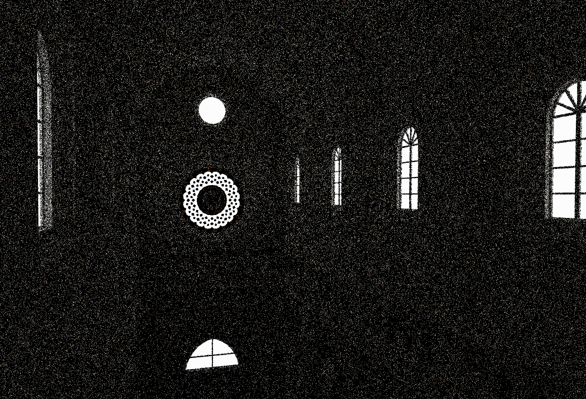
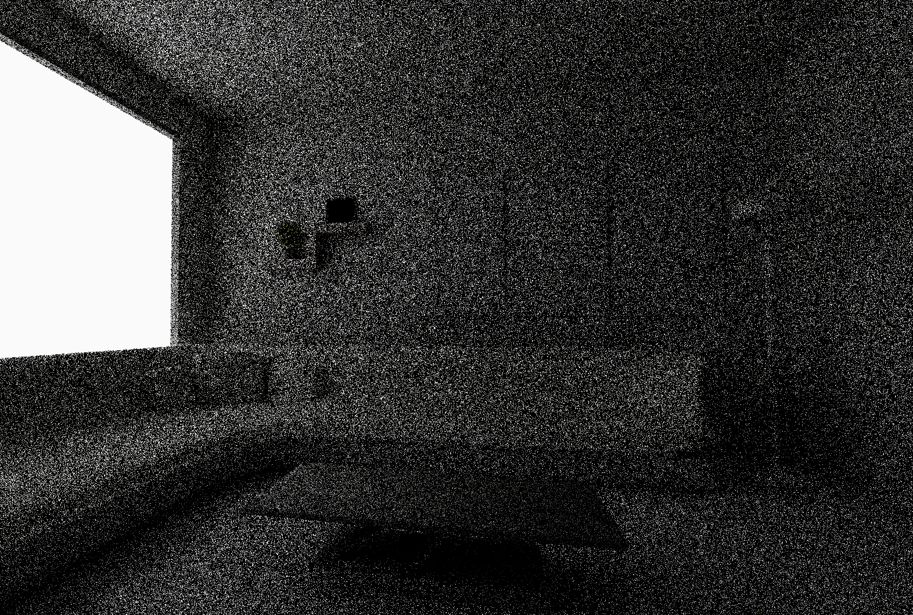
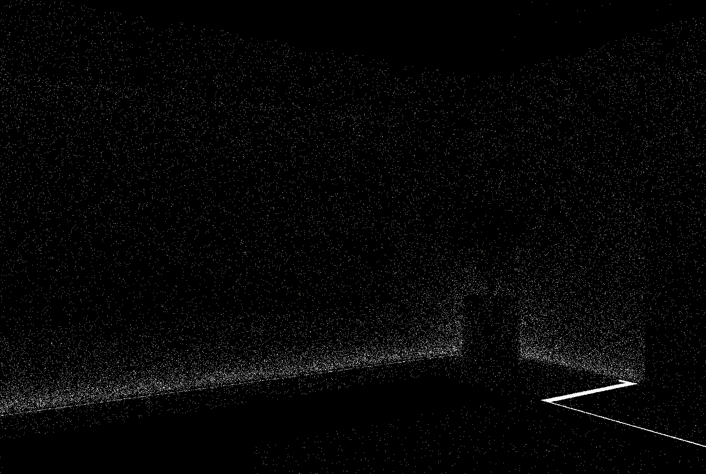
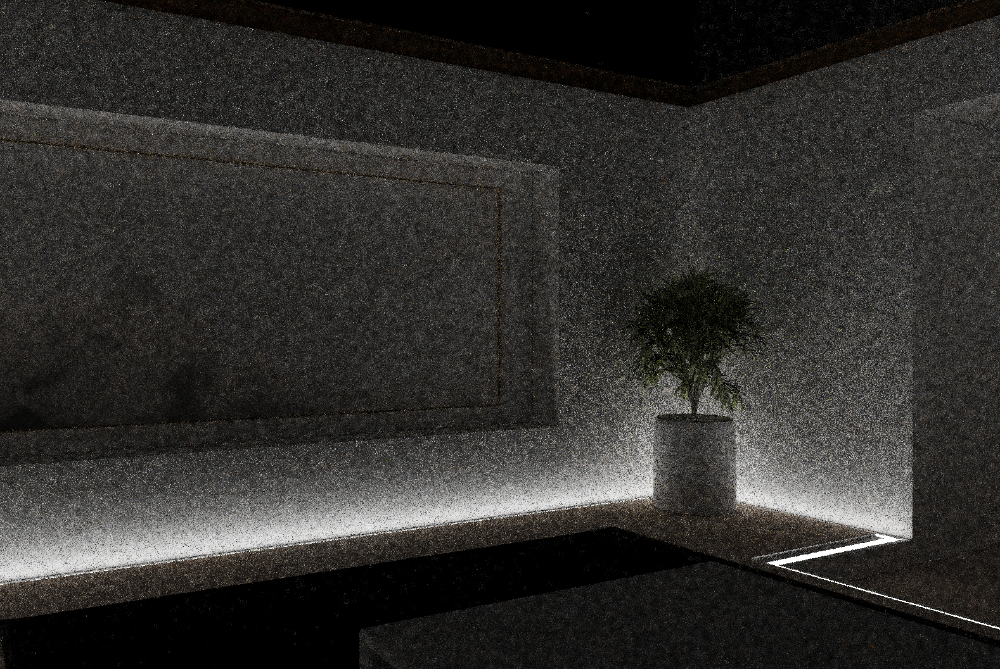
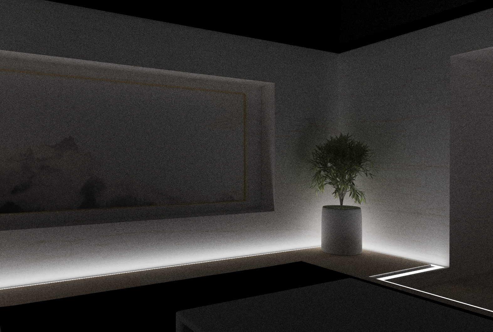

# XVK_Ray
A high-performance path tracer based on Vulkan Ray Tracing API, featuring an implementation of the ReSTIR GI (Path Resampling for Real-Time Path Tracing) algorithm. 
## Rendering Results Comparison

| Scene | 1spp Path Tracing | ReSTIR GI (Temporal) | ReSTIR GI (Spatial) | Reference (Converged) |
| :--- | :---: | :---: | :---: | :---: |
| **Scene1** |  **~2.8 ms** |  **~2.9 ms** |  **~3.3 ms** |  **Reference** |
| **Scene2** |  **~1.2 ms** |  **~1.7 ms** |  **~2.3 ms** |  **Reference** |
| **Scene3** |  **~2.6 ms** |  **~2.8 ms** |  **~2.8 ms** |  **Reference** |
