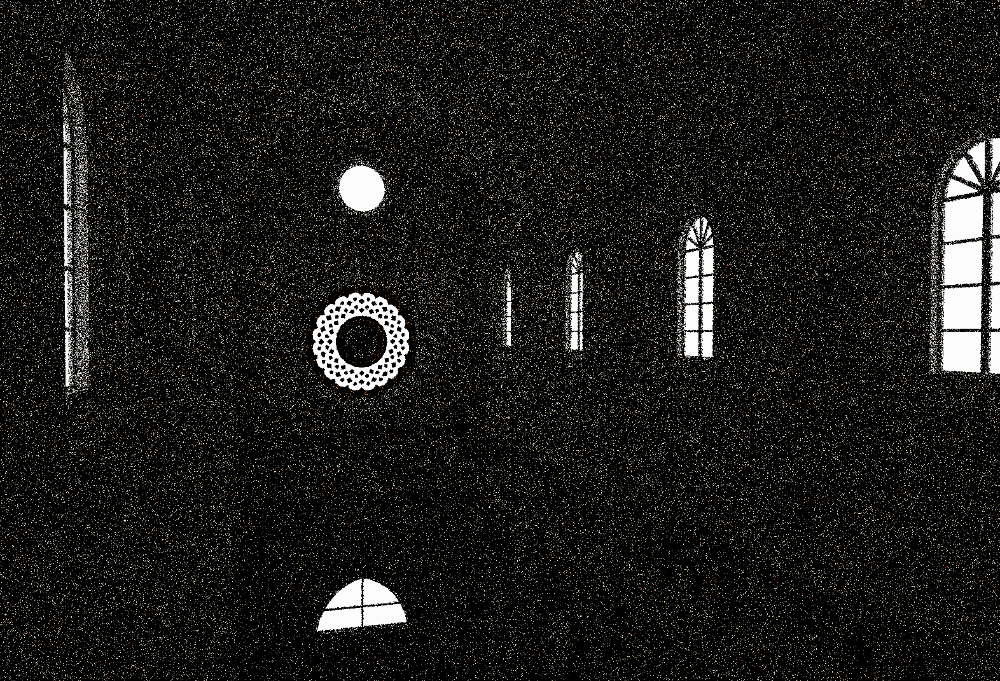
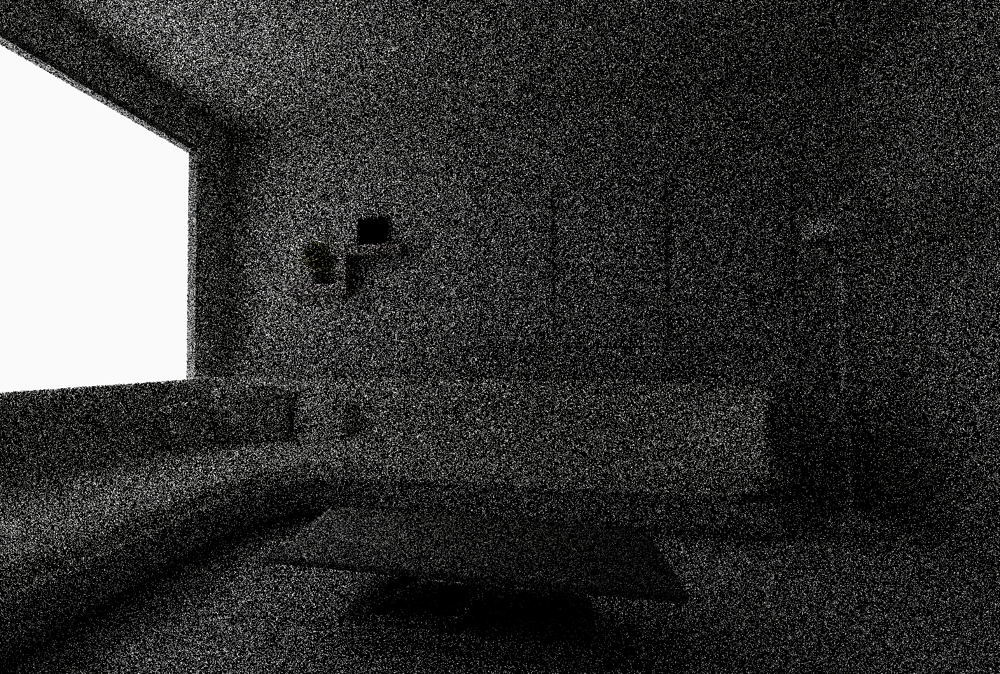
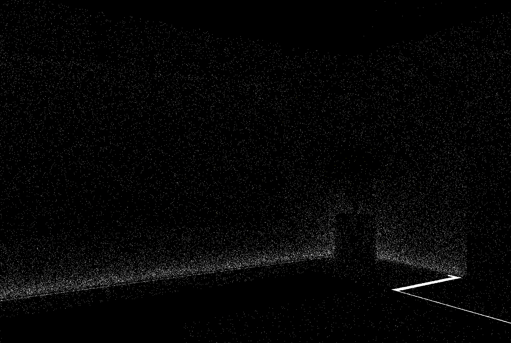
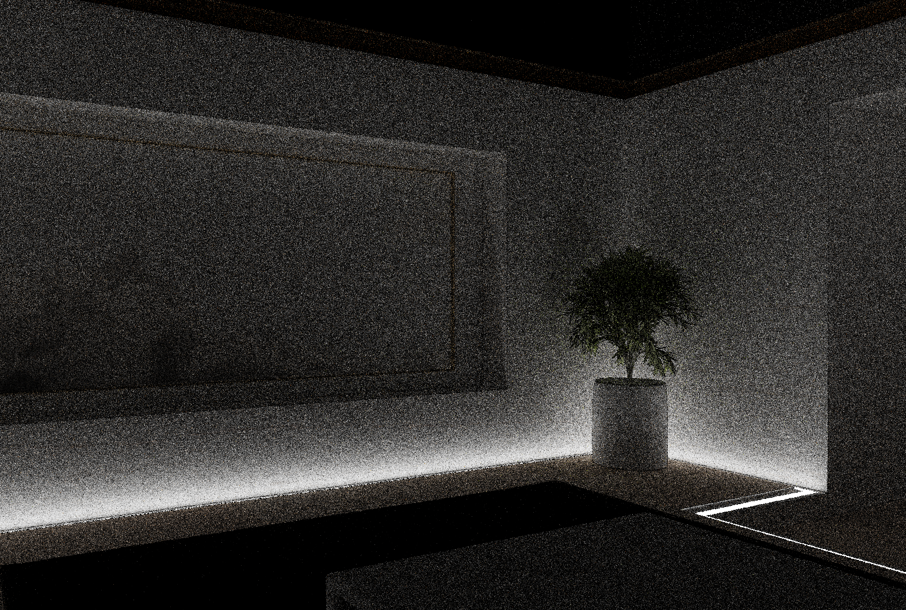
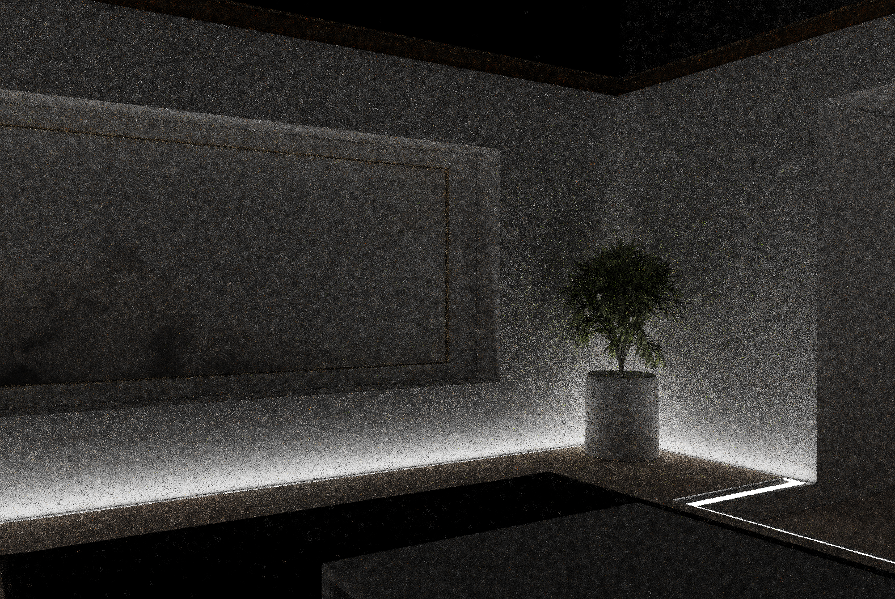
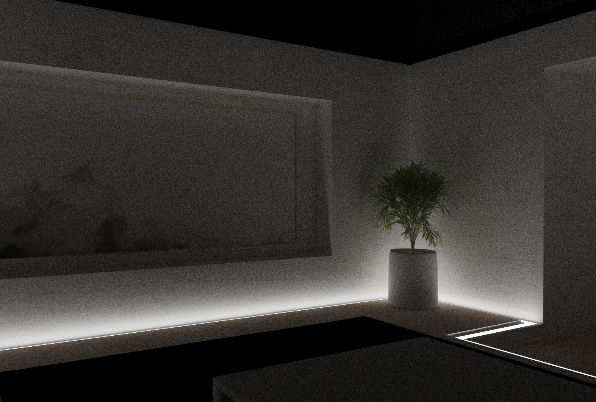

# XVK_Ray
一个基于 Vulkan Ray Tracing API 的高性能路径追踪器，实现了 ReSTIR GI (Path Resampling for Real-Time Path Tracing) 算法。

## 渲染结果对比

| 场景 | 1spp 路径追踪 | ReSTIR GI (时间域) | ReSTIR GI (空间域) | 参考图 (收敛) |
| :--- | :---: | :---: | :---: | :---: |
| **Scene1** |  **~2.8 ms** |  **~2.9 ms** |  **~3.3 ms** |  **Reference** |
| **Scene2** |  **~1.2 ms** |  **~1.7 ms** |  **~2.3 ms** |  **Reference** |
| **Scene3** |  **~2.6 ms** |  **~2.8 ms** |  **~2.8 ms** |  **Reference** |
